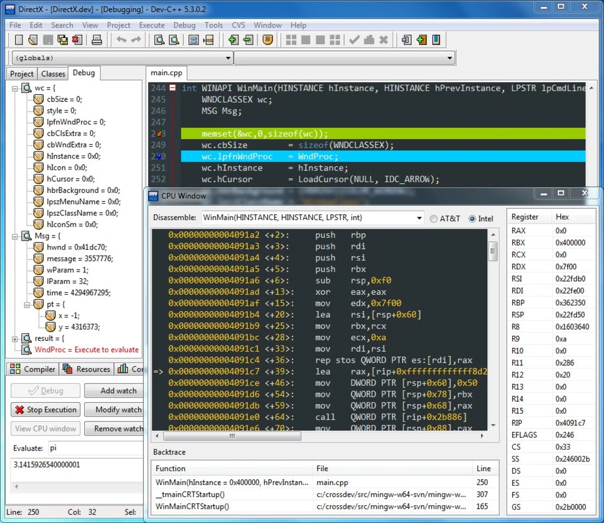

简介：C++之HelloWorld！
<!-- more -->

>## 编程环境软件推荐

### Visual Studio

微软开发的号称宇宙第一开发环境的Visual Studio，功能强大。


Visual Studio下载地址：[传送门](https://visualstudio.microsoft.com/zh-hans/free-developer-offers/)

### VSCode

微软推出的一款跨平台编辑器，有丰富的插件库，支持绝大多数编程语言，逐渐成为最主流的编辑器。


下载地址：[传送门](https://code.visualstudio.com/)

### JetBrains Clion

JetBrains公司推出的C/C++跨平台集成开发环境，功能强大，专注开发，JetBrains开发必属精品，适合专业开发使用。


下载地址：[传送门](http://www.jetbrains.com/clion/)

### Eclipse For C++

老牌跨平台集成开发环境，丰富的插件和简洁的开发界面。


下载地址：[传送门](https://www.eclipse.org/downloads/)

### DEV C++

老牌C++集成开发环境，小巧强大。



DEV-C++下载地址：[传送门](https://bloodshed-dev-c.en.softonic.com/ )

### Code::Blocks

老牌跨平台集成开发环境，界面清爽，适合学习使用，专业开发也可以胜任。


下载地址：[传送门](http://www.codeblocks.org/downloads)

>## 第一个C++程序

### 示例代码
```c++
#include <iostream>
using namespace std;
int main(){
	cout<<"Hello World!"<<endl;
	return 0;
}
```

### 执行结果

